# LINE Bot Backend Server

A LINE Bot webhook server integrated with OpenAI API for processing text messages and analyzing images.

## Features

- ✅ LINE Bot webhook integration
- ✅ OpenAI GPT-3.5-turbo for text processing
- ✅ OpenAI GPT-4 Vision for image analysis
- ✅ Automatic webhook signature verification
- ✅ Support for text and image messages
- ✅ Express.js server setup
- ✅ CORS enabled
- ✅ Environment variables support
- ✅ Error handling middleware
- ✅ Health check endpoint

## Architecture

```mermaid
graph TD
    A[👤 User] -->|Sends text/image| B[📱 LINE Chat Bot]
    B -->|Webhook POST| C[🚀 Express Server<br/>Railway.app]
    C -->|Image Analysis| D[🤖 OpenAI GPT-4 Vision API]
    C -->|Text Processing| E[🤖 OpenAI GPT-4o API]
    
    D -->|AI Response| C
    E -->|AI Response| C
    C -->|Reply Message| B
    B -->|Shows response| A
    
    style A fill:#e1f5fe
    style B fill:#f3e5f5
    style C fill:#e8f5e8
    style D fill:#fff3e0
    style E fill:#fff3e0
```



### Data Flow
1. **User Input**: User sends text or uploads image via LINE chat
2. **Webhook Trigger**: LINE sends webhook POST request to Railway server
3. **Processing**: Express server processes the request:
   - **Text messages** → OpenAI GPT-3.5 Turbo API
   - **Image messages** → OpenAI GPT-4 Vision API (Ruckus AP analysis)
4. **AI Response**: OpenAI returns processed response
5. **Reply**: Server sends response back to user through LINE Bot

## Installation

1. Install dependencies:
```bash
npm install
```

2. Create a `.env` file in the root directory with your credentials:
```env
PORT=3000
NODE_ENV=development

# LINE Bot Configuration (Required)
LINE_CHANNEL_ACCESS_TOKEN=your_line_channel_access_token
LINE_CHANNEL_SECRET=your_line_channel_secret

# OpenAI Configuration (Required)
OPENAI_API_KEY=your_openai_api_key
```

### Getting Your Credentials

#### LINE Bot Setup:
1. Go to [LINE Developers Console](https://developers.line.biz/)
2. Create a new provider and channel (Messaging API)
3. Get your Channel Access Token and Channel Secret from the channel settings
4. Set the webhook URL to `https://your-domain.com/webhook`

#### OpenAI Setup:
1. Go to [OpenAI Platform](https://platform.openai.com/)
2. Create an API key from the API keys section
3. Make sure you have credits in your account for API usage

## Usage

### Start the server (production):
```bash
npm start
```

### Start the server (development with auto-restart):
```bash
npm run dev
```

The server will start on `http://localhost:3000` (or the port specified in your `.env` file).

## API Endpoints

### LINE Bot Webhook
- `POST /webhook` - **Main endpoint for LINE Bot messages**
  - Receives text and image messages from LINE users
  - Processes text with OpenAI GPT-3.5-turbo
  - Analyzes images with OpenAI GPT-4 Vision
  - Automatically replies back to the user

### Base Routes
- `GET /` - Welcome message
- `GET /health` - Health check endpoint


### Specialized Features

This LINE Bot is specifically designed as a **Ruckus Networks Sales Assistant**:

- **Image Analysis**: Upload photos of spaces to get professional Ruckus AP recommendations
- **Technical Consultation**: Provides specific AP model suggestions (R650, R750, R350, etc.)
- **Budget Estimates**: Calculates costs for wireless infrastructure deployment
- **Sales Engineering**: Acts as a knowledgeable Ruckus sales engineer

### How It Works

1. **User sends a message** to your LINE Bot (text or image)
2. **LINE sends webhook** to your Railway-hosted `/webhook` endpoint  
3. **Server processes the message:**
   - **Text messages** → OpenAI GPT-3.5-turbo for general assistance
   - **Image messages** → OpenAI GPT-4 Vision for Ruckus AP site analysis
4. **OpenAI responds** with:
   - Professional sales engineering analysis
   - Specific AP model recommendations  
   - Budget estimates and technical justification
5. **Server replies back** to the user via LINE Bot

### Testing the Webhook (for development)

You can test the webhook locally using ngrok or similar tools:

```bash
# Install ngrok
npm install -g ngrok

# Expose your local server
ngrok http 3000

# Use the ngrok URL as your LINE webhook URL
# Example: https://abc123.ngrok.io/webhook
```

### Example Usage

**Text Query:**
```
User: "What's the difference between R650 and R750?"
Bot: [Provides detailed comparison of Ruckus AP models]
```

**Image Analysis:**
```
User: [Uploads photo of office space]
Bot: "Nice open office space! 

📍 Place Type: Modern open office
📐 Estimated Size: ~200m²
🧠 Use Case: High-density business environment
📡 Recommended Ruckus AP(s):
   - Model: R650
   - Quantity: 4 units
   - Justification: [Technical reasoning]
💰 Budget Estimate: Total estimated cost: $2,400 USD"
```

### API Testing

```bash
# Health check
curl https://your-app.railway.app/health

# Welcome message
curl https://your-app.railway.app/
```

## Project Structure

```
├── server.js          # Main server file
├── package.json       # Dependencies and scripts
├── .gitignore         # Git ignore rules
├── .env              # Environment variables (create manually)
└── README.md         # Project documentation
```

## Dependencies

- **express**: Fast, unopinionated web framework for Node.js
- **@line/bot-sdk**: Official LINE Bot SDK for Node.js
- **openai**: Official OpenAI API client
- **axios**: HTTP client for API requests
- **cors**: Enable Cross-Origin Resource Sharing
- **dotenv**: Load environment variables from .env file

## Development Dependencies

- **nodemon**: Monitor for changes and automatically restart server

## Supported Message Types

- ✅ **Text Messages**: Processed with OpenAI GPT-3.5-turbo
- ✅ **Image Messages**: Analyzed with OpenAI GPT-4 Vision
- ❌ **Other Types**: Audio, Video, Location (not yet supported)

## Next Steps

You can extend this LINE bot by:
- Adding support for audio/video messages
- Implementing conversation memory/context
- Adding database for user preferences
- Creating custom OpenAI prompts for different scenarios
- Adding rich message types (templates, carousels)
- Implementing group chat functionality
- Adding user authentication and personalization
- Setting up logging and analytics
- Adding rate limiting for API calls 